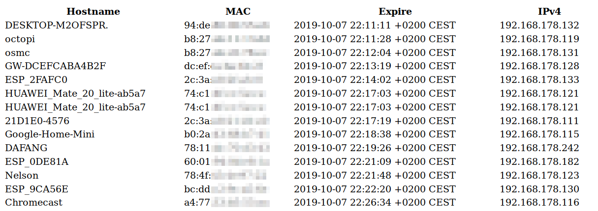

# kea2html
I use kea-dhcp4 in my home network and wanted a simple way to have an overview over the devices in my house. This
script parses the csv file written by kea-dhcp when you use "memfile" as type for the leases-database.

I use [packr](https://github.com/gobuffalo/packr/tree/master/v2) to bundle the html into the binary which makes
deployment more easy. To build this project you first have to install the packr2 cli tool and then run `packr2
build`. This produces a single binary which includes all files and can be moved to your router/DHCP-Server.

## Example



## Usage
```
Usage of ./kea2html:
  -in string
    	Path to your leases csv file (default "/var/lib/kea/kea-leases4.csv")
  -out string
    	Path to the rendered HTML file (default "output.html")
```
